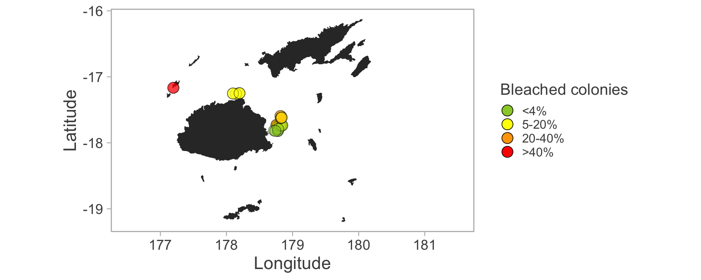
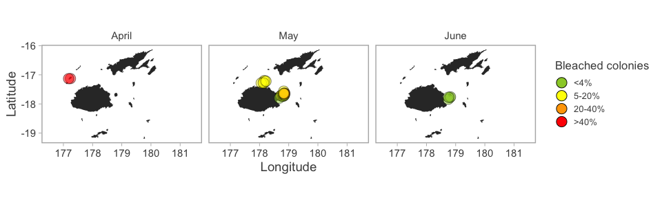

<!-- README.md is generated from README.Rmd. Please edit README.Rmd (this file) -->
R-MERMAID
=========

A repo of useful R code for MERMAID analyses and figures.

Contains a dataset of collected underwater observations from WCS and Manta Trust coral bleaching surveys from the Yasawas, Ra, Ovalau and Leleuvia in Fiji collected between April-June 2019. Learn more about the rapid coral bleaching assessment (<http://www.wcs.org/coral>)

We plan to add more resource code to support MERMAID analysis in the future.

Exciting demo showing how the data and code produces a histogram of coral bleaching and a map of coral bleaching reports from the dataset. All code draws on a real dataset of bleaching observations (by coral genus) downloaded from MERMAID (<http://www.datamermaid.org>)

With thanks to data contributors: Stacy Jupiter (WCS Melanesia), Sangeeta Mangubhai (WCS Fiji), Emily Darling (WCS Global) and Rob Macfarlane (Barefoot Manta Resort, Fiji)
